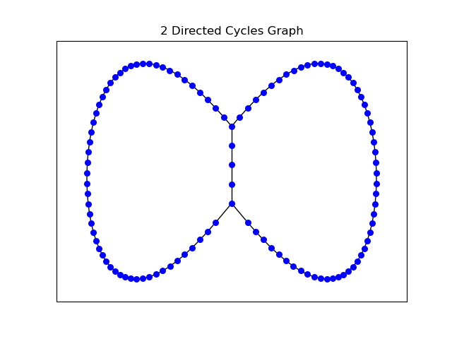
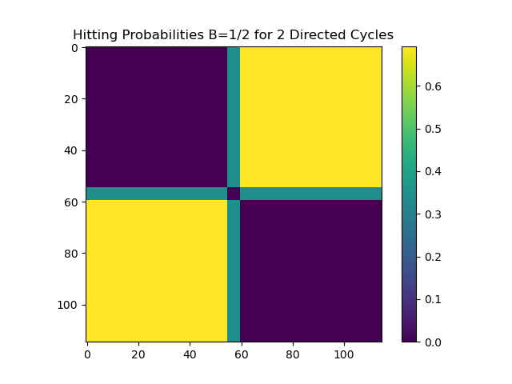
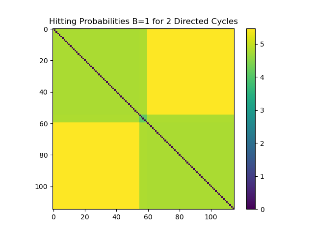
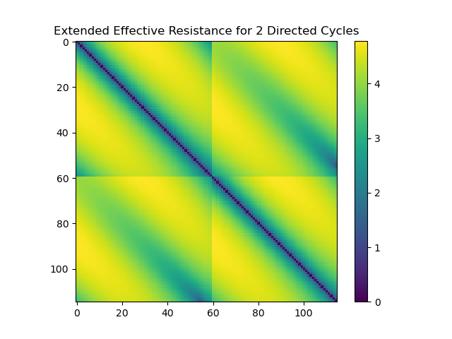
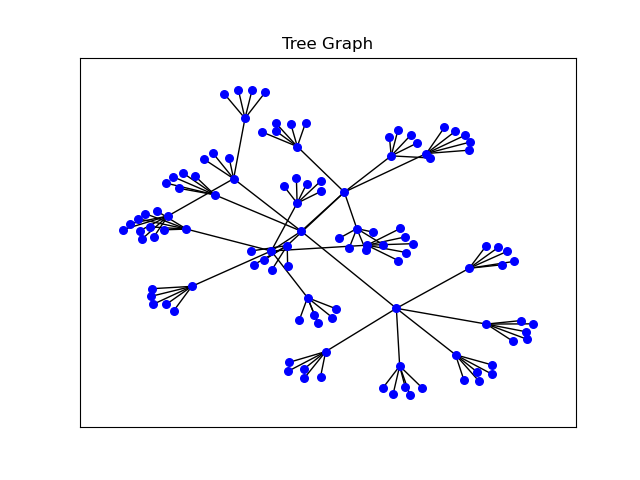
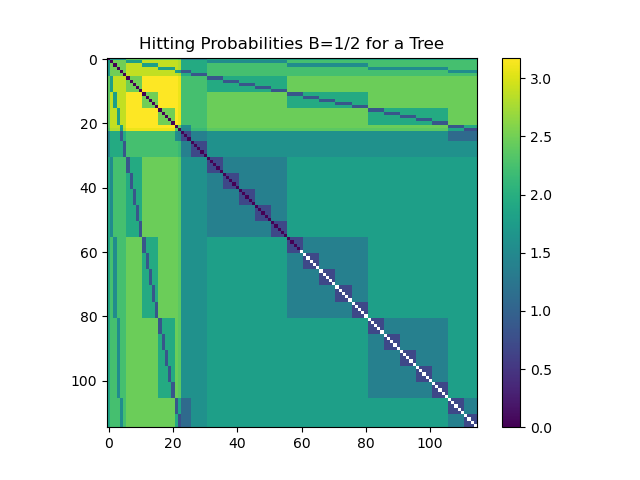
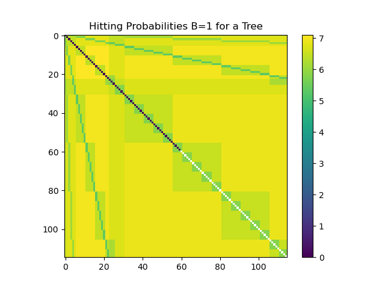
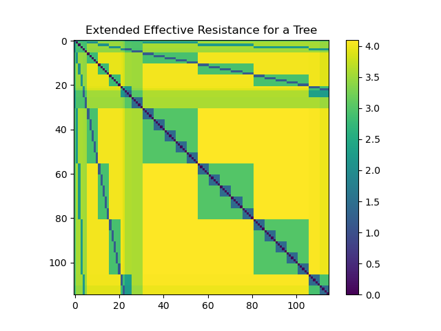

# Hitting-Probability-Metric-on-Directed-Graphs
This code is the Python adaptation of the MATLAB code found in the paper ["A Metric on Directed Graphs and Markov Chains Based on Hitting Probabilities,"](https://marzuola.web.unc.edu/wp-content/uploads/sites/16865/2020/06/A_metric_on_the_state_space_of_Markov_chains_based_on_hitting_times.pdf) by Boyd, Fraiman, Marzuola, Mucha, Osting, and Weare. This paper addresses the fact that shortest path and extended effective resistance graph metrics have been applied to directed graphs in the same way as undirected graphs, and seeks to find an alternative metric that is more suited for strongly connected directed graphs so that these graphs can be better analyzed. This new metric is based on any Markov Chain of a directed graph and uses random walkers to determine the hitting probability between any two nodes in a graph; that is, the probability that a random walker will move from one node to another before returning to the original node. In undirected graphs, this new metric is equal to the natural logarithm of the extended effective resistance divided by the commute time. 

   

   

## Description of Files: 
### Hitting Probability Metric on Directed Graphs includes 3 distinct functions with two examples.
1. [Hitting_Times.py](https://github.com/mgvinal/Hitting-Probability-Metric-on-Directed-Graphs/blob/main/Hitting_Times.py): returns a matrix of probabilities of leaving one node (i) and then hitting another node (j) before returning to the original node (i). It requires an input of a stochastic matrix. 
2. [get_Ahp.py](https://github.com/mgvinal/Hitting-Probability-Metric-on-Directed-Graphs/blob/main/get_Ahp.py): returns the invariant measure matrix of the matrix of probabilities found in HittingTimes_L3(M). This symmetric adjacency matrix is our new distance metric for directed graphs. 
3. [ext_eff_res.py](https://github.com/mgvinal/Hitting-Probability-Metric-on-Directed-Graphs/blob/main/ext_eff_res.py): finds the extended effective resistance, as defined in F. Young, L. Scardovi, and N. E. Leonard, [A new notion of effective resistance for directed graphs---Part I: Definition and properties"](https://doi.org/10.48550/arXiv.1310.5163). The input (A) must be the probability transition matrix for a directed or undirected graph. While the output of this function itself (R) is not a metric, R^0.5 is a well-defined metric that we will use in comparison to our new metrics. The accompanying code to this project was originally in MATLAB, so I translated this code to python as well. 
4. [ex_undirected_tree_script.py](https://github.com/mgvinal/Hitting-Probability-Metric-on-Directed-Graphs/blob/main/ex_undirected_tree_script.py): contains an example of a standard undirected tree graph. The extended effective resistance and hitting probabilities when beta=1 and 0.5 matrices are all computed and visualized via heatmaps. Additionally, a graph visualization of this tree is also generated. 
5. [ex_two_directed_cycles_glued_together_script.py](https://github.com/mgvinal/Hitting-Probability-Metric-on-Directed-Graphs/blob/main/ex_two_directed_cycles_glued_together_script.py): contains the example used in the original paper. This graph is directed and consists of two directed 60-node-length cycles, connected along 5 common nodes. This example also undergoes calculations of its extended effective resistance and hitting probabilities when beta=1 and 0.5 matrices. All of these matrices are visualized using a heatmap, and a graph visualization is also provided. 
## Funding Acknowledgment:
This project was supported by the National Science Foundation's (NSF) Focused Research Groups (FRG) Division of Mathematical Sciences (DMS) [grant number 2152289]. 
